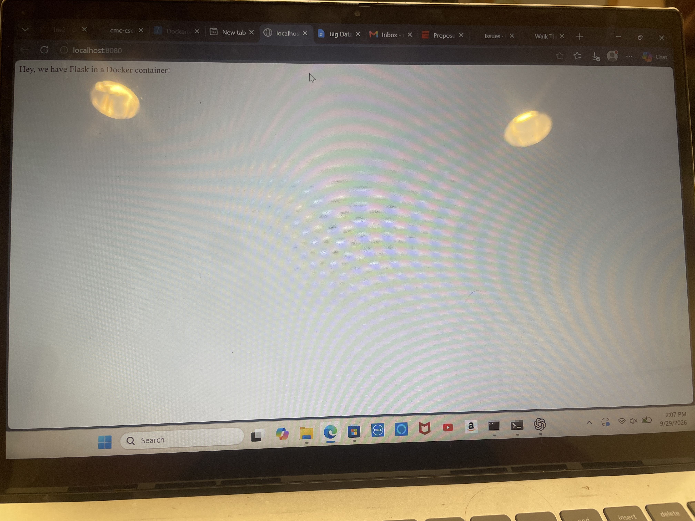

# Dockerized Flask Application

This project runs a Flask webpage in a Docker container using Python 2.7. Dependencies are pinned to compatible versions so the archived Runnable tutorial works without upgrading to Python 3.

